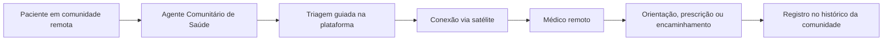
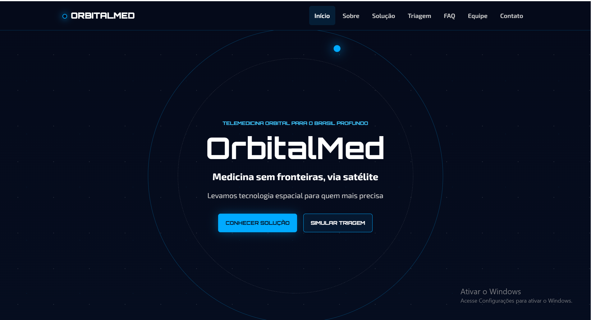
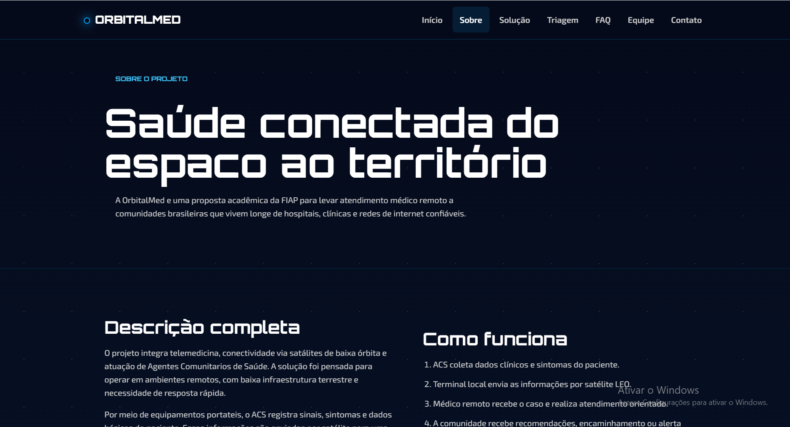
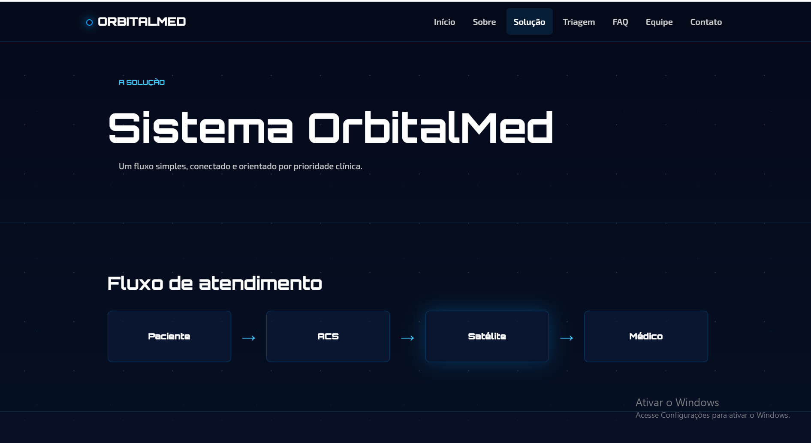
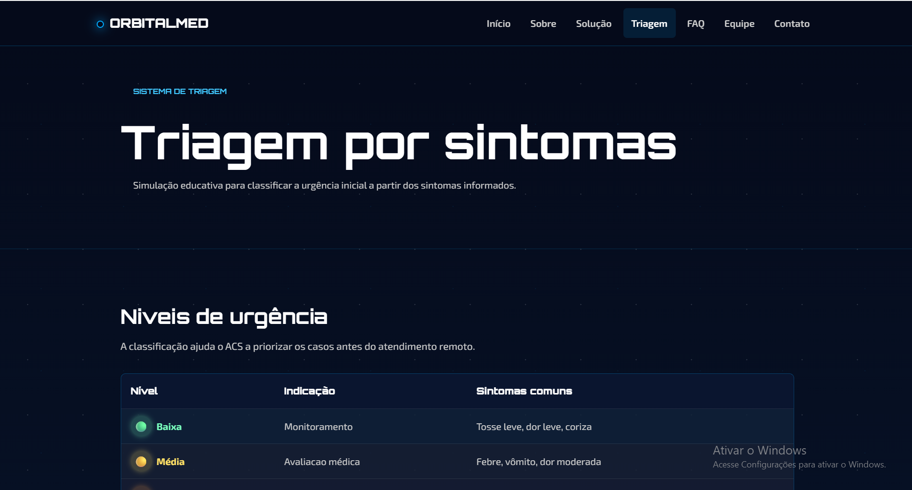
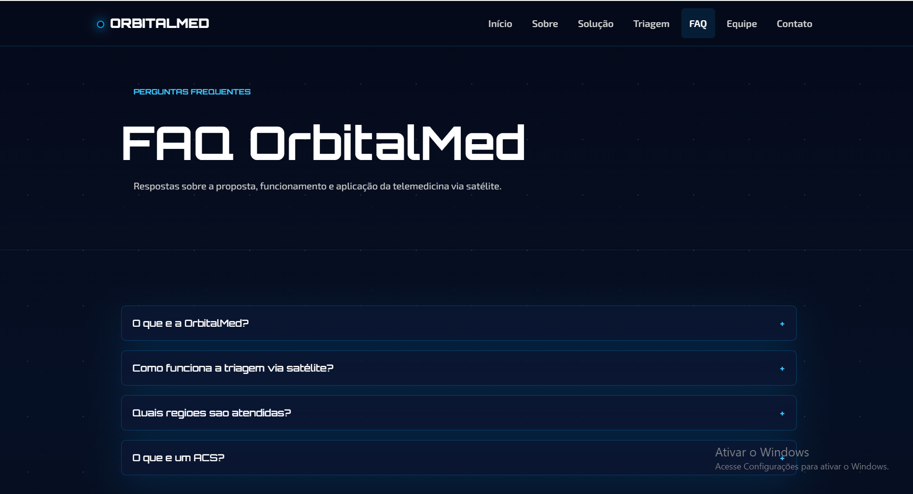
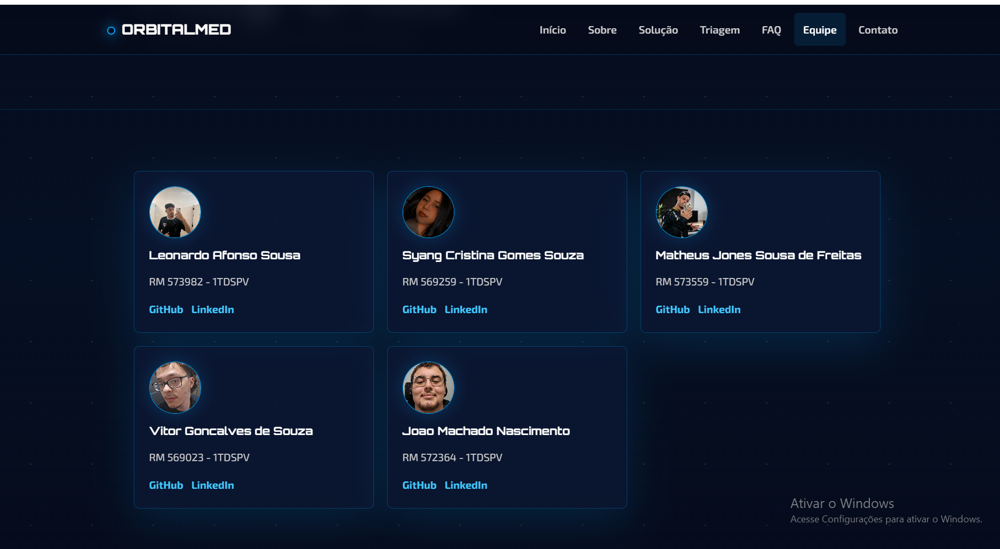
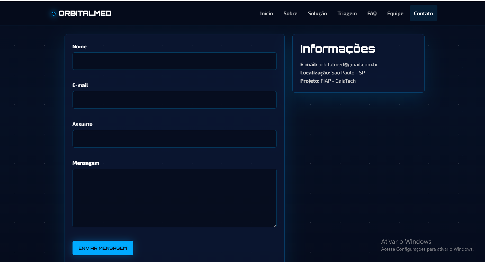

# OrbitalMed

## Medicina sem fronteiras, via satélite

A **OrbitalMed** é um projeto acadêmico desenvolvido para a **Global Solution 2026/1 — FIAP**, com o objetivo de apresentar uma solução digital de **telemedicina via conectividade satelital** para comunidades brasileiras isoladas, onde o acesso a médicos, internet convencional e infraestrutura de saúde pode ser limitado ou inexistente.

A proposta parte de um problema real: em regiões como a Amazônia, o Pantanal e o sertão nordestino, muitas comunidades enfrentam longas distâncias até o atendimento médico, ausência de sinal de internet, dificuldade de transporte em períodos de chuva e pouca presença de profissionais de saúde. A OrbitalMed utiliza o conceito de conectividade por satélites de baixa órbita para permitir **triagem, orientação médica, consulta remota e registro de histórico de atendimento**, mesmo em locais sem infraestrutura tradicional de telecomunicações.

> **O satélite é o meio. A pessoa em sofrimento é o propósito.**

---

## Objetivo do projeto

Desenvolver um site completo, funcional e responsivo para apresentar a solução **OrbitalMed**, explicando o problema abordado, o funcionamento da plataforma, o público-alvo, os diferenciais da proposta e uma simulação de triagem inicial.

O projeto foi construído com foco em:

- Estrutura HTML semântica;
- Design visual consistente;
- Responsividade para desktop, tablet e mobile;
- Navegação clara entre páginas;
- Interatividade com JavaScript;
- Organização de arquivos em pastas;
- Apresentação objetiva da solução proposta para o tema da Global Solution.

---

## Problema abordado

Em muitas regiões remotas do Brasil, o atendimento médico pode levar dias para chegar. Comunidades ribeirinhas, quilombolas, indígenas, rurais ou isoladas por eventos climáticos frequentemente enfrentam dificuldades como:

- Falta de médicos próximos;
- Ausência de internet estável;
- Estradas bloqueadas por chuvas, enchentes ou longas distâncias;
- Dificuldade para acionar serviços de emergência;
- Falta de acompanhamento preventivo para gestantes, idosos e crianças;
- Pouco histórico médico registrado para apoiar decisões de saúde pública.

A OrbitalMed busca reduzir esse impacto conectando pacientes, agentes comunitários de saúde e médicos por meio de uma estrutura digital apoiada em conectividade satelital.

---

## Solução proposta

A solução conceitual da OrbitalMed funciona em três camadas principais:

### 1. Conectividade satelital

Unidades de saúde ou pontos de atendimento em regiões remotas recebem um terminal de conexão via satélite, permitindo comunicação mesmo sem fibra óptica, 4G ou infraestrutura convencional.

### 2. Plataforma de triagem e consulta

Um **Agente Comunitário de Saúde (ACS)** utiliza um tablet ou dispositivo simples para registrar sintomas, sinais vitais e histórico do paciente. Essas informações são enviadas para um médico remoto, que pode orientar o atendimento, realizar consulta por vídeo ou voz e decidir se o caso exige encaminhamento ou evacuação de emergência.

### 3. Registro e histórico de atendimentos

Cada atendimento gera um registro, formando uma base de dados da comunidade. Com o tempo, esses dados podem auxiliar na identificação de surtos, demandas por vacinação, regiões de maior risco e prioridades de saúde pública.

Além disso, a proposta prevê evolução com um **chatbot de orientação emergencial**, capaz de guiar o usuário em primeiros passos de atendimento e identificação de sinais de alerta.

---

## Relação com o tema da Global Solution

O projeto se conecta ao tema **“O Espaço e a Nova Fronteira”** ao aplicar tecnologias associadas ao setor espacial, principalmente a comunicação via satélite, para resolver um problema concreto na Terra: o acesso desigual à saúde.

A conectividade satelital não é apenas um detalhe técnico da solução. Ela é o elemento que permite que a OrbitalMed funcione em regiões onde a internet convencional não chega.

---

## ODS relacionadas

A OrbitalMed se relaciona com os seguintes Objetivos de Desenvolvimento Sustentável da ONU:

- **ODS 3 — Saúde e Bem-Estar:** ampliar o acesso a cuidados de saúde de qualidade;
- **ODS 9 — Indústria, Inovação e Infraestrutura:** usar tecnologia e infraestrutura inovadora para reduzir gaps de acesso;
- **ODS 10 — Redução das Desigualdades:** apoiar populações vulneráveis e comunidades isoladas.

---

## Público-alvo

### Usuários diretos

- Agentes Comunitários de Saúde;
- Pacientes de comunidades remotas;
- Equipes locais de saúde.

### Organizações contratantes ou apoiadoras

- Prefeituras municipais;
- Secretarias Estaduais de Saúde;
- Ministério da Saúde;
- ONGs que atuam em regiões isoladas;
- Projetos sociais voltados à saúde pública.

---

## Diferenciais da OrbitalMed

- **Conectividade via satélite:** permite funcionamento em locais sem internet convencional;
- **Foco em comunidades isoladas:** solução pensada para quem mais sofre com a distância do atendimento médico;
- **Apoio ao Agente Comunitário de Saúde:** a plataforma auxilia o ACS no processo de triagem;
- **Triagem guiada:** coleta de sintomas e informações iniciais de forma organizada;
- **Histórico comunitário:** criação de registros que podem apoiar decisões de saúde pública;
- **Interface simples e acessível:** foco em clareza, objetividade e facilidade de uso.

---

## Funcionalidades do site

O site da OrbitalMed apresenta a proposta de forma clara e navegável, contendo:

- Página inicial com apresentação do projeto;
- Página sobre o problema e o contexto da solução;
- Página explicando o funcionamento da OrbitalMed;
- Simulação de triagem inicial;
- Página de perguntas frequentes;
- Página com os integrantes do grupo;
- Formulário de contato;
- Menu de navegação entre todas as páginas;
- Menu responsivo para dispositivos móveis;
- Interações em JavaScript;
- Layout adaptado para desktop, tablet e celular.

---

## Páginas do projeto

| Página | Descrição |
|---|---|
| `index.html` | Página inicial do projeto, com apresentação da OrbitalMed e chamada para a solução. |
| `sobre.html` | Explica o problema enfrentado por comunidades remotas e o contexto da proposta. |
| `solucao.html` | Apresenta a solução, seu funcionamento e seus principais diferenciais. |
| `triagem.html` | Simula uma triagem inicial para demonstrar a proposta de atendimento remoto. |
| `faq.html` | Reúne perguntas frequentes sobre a OrbitalMed e sua viabilidade. |
| `integrantes.html` | Apresenta os membros do grupo com informações de identificação. |
| `contato.html` | Disponibiliza um formulário de contato funcional com validação. |

---

## Tecnologias utilizadas

- **HTML5:** estruturação semântica das páginas;
- **CSS3:** estilização, layout, identidade visual e responsividade;
- **JavaScript:** interatividade, menu responsivo, validação de formulário, FAQ e simulação de triagem;
- **Git e GitHub:** versionamento e hospedagem do código-fonte.

---

## Estrutura de pastas

```text
OrbitalMed/
│
├── assets/
│   ├── foto_leo.png
│   ├── foto_syang.png
│   ├── foto_jones.png
│   ├── foto_vitor.png
│   ├── foto_machado.png
│   │
│   └── prints/
│       ├── home.png
│       ├── sobre.png
│       ├── solucao.png
│       ├── triagem.png
│       ├── faq.png
│       ├── integrantes.png
│       └── contato.png
│
├── css/
│   ├── style.css
│   └── responsive.css
│
├── js/
│   └── main.js
│
├── pages/
|   ├── contato.html
│   ├── faq.html
│   ├── integrantes.html
│   ├── sobre.html
│   ├── solucao.html
│   └── triagem.html
│    
├── index.html
└── README.md
```

---

## Fluxo conceitual da solução



---

## Imagens e elementos visuais

O projeto utiliza imagens dos integrantes na página de equipe e é complementado com prints das telas principais do sistema.

### Fotos dos integrantes

As fotos da equipe estão armazenadas na pasta `assets/` e são utilizadas na página `integrantes.html`.

## Prints do projeto

### Página inicial



### Página Sobre



### Página Solução



### Simulação de Triagem



### FAQ



### Integrantes



### Contato




## Responsividade

O layout foi desenvolvido para se adaptar a diferentes tamanhos de tela, incluindo:

- Desktop;
- Tablet;
- Smartphone.

O projeto utiliza CSS responsivo e menu mobile para garantir boa navegação em telas menores.

---


## Integrantes

| Integrante | RM | Turma | GitHub | LinkedIn |
|---|---:|---|---|---|
| Leonardo Afonço Sousa | 573982 | 1TDSPV | [GitHub](https://github.com/Leonardo-2112) | [LinkedIn](https://www.linkedin.com/in/leonardoafoncosousa/) |
| Syang Cristina Gomes Souza | 569259 | 1TDSPV | [GitHub](https://github.com/SyangSouzaa) | [LinkedIn](https://www.linkedin.com/in/syang-souza/) |
| Matheus Jones Sousa de Freitas | 573559 | 1TDSPV | [GitHub](https://github.com/Matheus-Jones) | [LinkedIn](https://www.linkedin.com/in/matheus-jones10/) |
| Vitor Gonçalves de Souza | 569023 | 1TDSPV | [GitHub](https://github.com/v1torceleste) | [LinkedIn](https://www.linkedin.com/in/vitor-souza-39aa422b4/) |
| João Machado Nascimento | 572364 | 1TDSPV | [GitHub](https://github.com/MachadoJN) | [LinkedIn](https://www.linkedin.com/in/jo%C3%A3o-machado-493178300) |

---

## Link do repositório

```text
https://github.com/Leonardo-2112/OrbitalMed
```

---

## Contato

Para dúvidas, sugestões ou informações sobre o projeto, entre em contato com os integrantes do grupo por meio dos links de GitHub e LinkedIn informados na seção de integrantes.

```text
orbitalmed@gmail.com
```

---

## Contexto acadêmico

Projeto desenvolvido para a disciplina de **Front-End Design Engineering**, como parte da **Global Solution 2026/1 — FIAP**.

A OrbitalMed representa uma proposta acadêmica de inovação social e tecnológica, utilizando o espaço e a conectividade satelital como caminho para aproximar atendimento médico de populações que vivem longe dos grandes centros urbanos.
